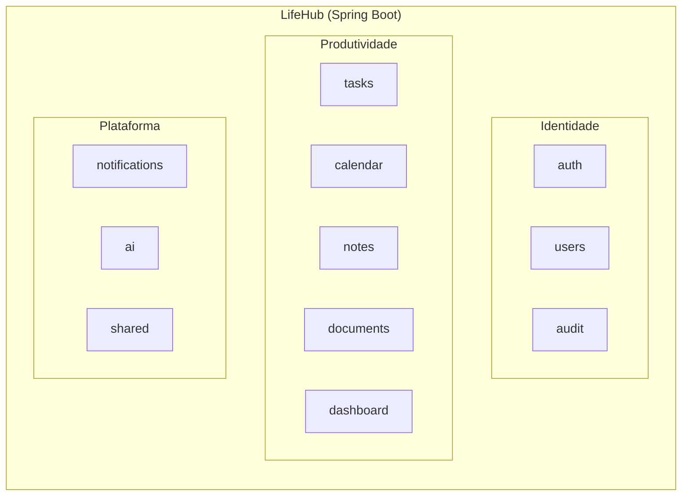
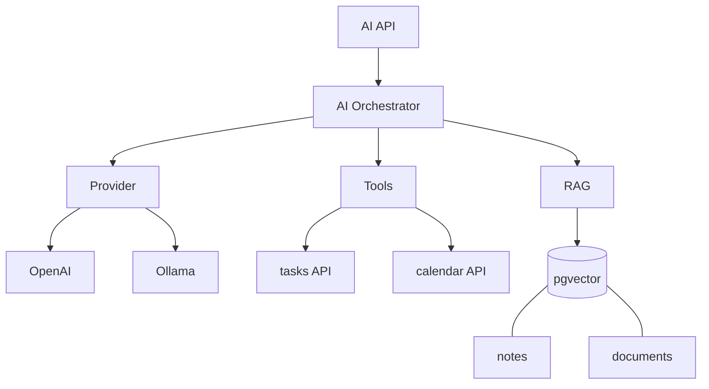

# Arquitetura

> Status: **rascunho — CARD-000**. Decisão principal registrada em [ADR-001](../adr/ADR-001-modular-monolith.md).

## 1. Estilo arquitetural: Modular Monolith

O LifeHub começa como **um único deployable Spring Boot**, organizado internamente em **módulos com limites explícitos**. Um módulo evolui sem depender da implementação interna de outro. Se no futuro houver uma necessidade real de distribuição, um módulo pode ser extraído para um serviço.

### Módulo ≠ camada

```text
❌ Por camada (evitar)          ✅ Por módulo (capacidade de negócio)
com.lifehub                     com.lifehub
├── controller/                 ├── tasks/
├── service/                    │   ├── TaskApi.java        ← API pública do módulo
└── repository/                 │   └── internal/           ← ninguém de fora acessa
                                ├── calendar/
                                ├── notes/
                                └── shared/
```

Cada módulo tem:
- uma **API pública** (interfaces, DTOs e eventos) que os outros módulos podem usar;
- uma parte **interna** (entidades, repositórios, serviços) que ninguém de fora acessa;
- **suas próprias tabelas**. Nenhum outro módulo lê ou escreve nelas diretamente.

> A garantia dessas regras (Spring Modulith ou ArchUnit) entra no CARD-003.

## 2. Visão geral



> O Kanban é tratado como uma **visão** do módulo `tasks` (estado + ordenação), não como um módulo separado.
>
> ✍️ Você concorda? Se discordar, justifique.

**Resposta:** sim. Status e ordem são atributos da tarefa. Um módulo `kanban` separado criaria duas fontes de verdade sobre o status da mesma tarefa e exigiria sincronizá-las.

## 3. Módulos

Para cada módulo, complete a frase: **"Este módulo é dono de ___ e ninguém mais altera ___."**

| Módulo | Responsabilidade | É dono de (ninguém mais altera) | Release |
|---|---|---|---|
| `auth` | Login, JWT, refresh tokens, sessões, MFA, recuperação de senha | Credenciais, tokens e sessões | MVP / Security |
| `users` | Usuários e suas configurações | Cadastro e preferências do usuário (e-mail, fuso horário) | MVP |
| `tasks` | Tarefas: prioridade, prazo, etiquetas, status (Kanban) | Tarefas, etiquetas, status e ordem no Kanban | MVP |
| `calendar` | Eventos e compromissos | Eventos e compromissos | MVP |
| `notes` | Notas pessoais e conhecimento | Notas e as referências feitas dentro delas | MVP |
| `dashboard` | Visão agregada do dia e visões personalizadas | Só a configuração das visões personalizadas; os dados exibidos são dos outros módulos | MVP |
| `audit` | Registro de ações relevantes (humanas e de agentes) | Registros de auditoria (só inclusão, nunca alteração) | MVP |
| `notifications` | Lembretes agendados e notificações internas e externas (e-mail) | Lembretes (quando disparar e se já foi enviado), notificações e o status de envio | Messaging |
| `documents` | Upload, metadados, extração, chunks | Arquivos, metadados, texto extraído e chunks | Documents |
| `ai` | Providers, orquestração, tools, RAG, agentes | Configuração de providers e histórico de execuções dos agentes | AI |
| `shared` | Tipos e utilitários técnicos comuns (sem regras de negócio) | — | Foundation |

> ⚠️ **Armadilha:** `shared` vira depósito de tudo. Regra: se tem regra de negócio, não é `shared`.

## 4. Dependências permitidas

> ✍️ **Pergunta 4 do CARD-000.** Uma tarefa com data é um evento do calendário? Um lembrete pertence a Tasks, Calendar ou Notifications?

**Resposta:** uma tarefa com data aparece no calendário, continua pertencendo a `tasks` e gera um lembrete. Por isso `calendar` lê as tarefas com data pela API de `tasks` (pós-MVP).

**O lembrete pertence a `notifications`**, que é dono do disparo:
- `tasks` e `calendar` publicam eventos quando um prazo ou evento é criado, alterado, concluído ou excluído.
- `notifications` reage gravando (ou cancelando) um lembrete com a hora de disparo e a marca de "já enviado".
- Um **único job agendado** em `notifications` envia os lembretes vencidos e ainda não enviados. Tarefas vencendo e eventos do calendário ("reunião em 15 min") usam o mesmo mecanismo.
- A recuperação quando o notebook religa ([vision.md §6](vision.md)) sai do mesmo job: lembretes que venceram com o notebook desligado continuam "não enviados" e são enviados, marcados como atrasados.

> ✍️ **Pergunta 5 do CARD-000.** Notes pode referenciar Tasks? Em que direção vai a dependência?

**Resposta:** sim, com referências no estilo de links Markdown. Ao clicar na referência, a tarefa aparece num balão (popover), sem trocar de tela. A dependência vai de `notes → tasks`. Fica fora do MVP (pós-MVP de produtividade).

> ✍️ **Pergunta 6 do CARD-000.** O Dashboard lê as tabelas dos outros módulos ou chama as APIs públicas deles?

**Resposta:** o dashboard **só chama as APIs públicas** dos outros módulos e nunca lê as tabelas deles. Não tem dados próprios além da configuração das visões personalizadas.

Se no CARD-019 a performance não bastar, a saída é um **read model próprio do dashboard**, alimentado por eventos dos outros módulos, e essa exceção é registrada num ADR. `JOIN` entre schemas de módulos diferentes é proibido.

> ✍️ **Pergunta 7 do CARD-000.** Como evitar que `ai` vire o "módulo Deus" que depende de todos?

**Resposta:** a IA será direcionada a tarefas específicas, personalizadas quando chegar a fase de IA, em vez de ter acesso genérico a tudo. Além disso:
- `ai` pode depender de vários módulos, mas **só das APIs públicas** deles. Assim, as regras de negócio e a autorização continuam valendo quando é a IA agindo, e `ai` nunca conhece a parte interna de ninguém.
- Nenhum módulo depende de `ai`: ela fica na ponta do grafo e pode ser desligada sem afetar o resto.
- Como opção futura, a dependência pode ser invertida (cada módulo registra suas tools numa interface definida em `ai`). Decidir na fase de IA.

### Matriz de dependências

Marque ✅ onde o módulo da **linha** pode depender do módulo da **coluna**. Não pode haver ciclos.

| depende de → | auth | users | tasks | calendar | notes | documents | audit | notifications | dashboard | ai |
|---|---|---|---|---|---|---|---|---|---|---|
| **auth** | — | ✅ API | | | | | ✅ | | | |
| **users** | | — | | | | | ✅ | | | |
| **tasks** | | | — | | | | ✅ | | | |
| **calendar** | | ✅ (fuso horário) | ✅ API (pós-MVP) | — | | | ✅ | | | |
| **notes** | | | ✅ API (pós-MVP) | | — | | ✅ | | | |
| **documents** | | | | | | — | ✅ | | | |
| **dashboard** | | ✅ | ✅ API | ✅ API | ✅ API | | | | — | |
| **notifications** | | ✅ (e-mail) | ✅ eventos | ✅ eventos | | | | — | | |
| **ai** | | | ✅ API | ✅ API | ✅ API | ✅ API | ✅ | | | — |
| **audit** | | | | | | | — | | | |

Regras que a matriz deixa explícitas:
- **Ninguém depende de `auth`, `dashboard`, `ai` ou `notifications`.** Eles ficam nas pontas do grafo.
- **`audit` não depende de ninguém.** Os módulos chamam `audit.record(...)` e ele só recebe os registros.
- **Todos podem depender de `shared`.** Por isso ele não aparece como coluna.
- **Módulos de negócio não dependem de `users` só para saber o dono do dado.** O `userId` do usuário logado vem do contexto de segurança, como um tipo `UserId` em `shared`. Depende de `users` só quem precisa de dados do usuário, como fuso horário ou e-mail.
- **Dependências vão sempre para as APIs públicas** (interfaces, DTOs e eventos), nunca para `internal/` ou tabelas de outro módulo.
- **Não há ciclos.**

> Pendência: a dependência `ai → tasks/calendar/notes/documents` pode ser invertida (cada módulo registra suas tools numa interface definida em `ai`), trocando o acoplamento de lado. Decidir na fase de IA.

### Formas de comunicação entre módulos
1. **Chamada síncrona à API pública** (interface Java): simples, mas cria acoplamento em tempo de execução.
2. **Eventos de domínio** (in-process e, depois, RabbitMQ): o módulo emissor não conhece quem reage.

> ✍️ Qual você usa em cada relação acima, e por quê?

**Resposta:**
- **API síncrona** quando o módulo precisa de dados para responder na hora:
  - `auth → users`: o login precisa das credenciais do usuário antes de responder.
  - `calendar → tasks`, `dashboard → *` e `ai → *`: são leituras para montar uma tela ou uma resposta. O usuário espera ver os dados atuais, então consistência imediata vale mais que desacoplamento.
  - `* → audit`: a chamada acontece na mesma transação da ação. Se a ação for gravada, o registro de auditoria também é. É um trade-off consciente: em troca da consistência, todos os módulos dependem de `audit`. No CARD-013, avaliar a alternativa de publicar um evento consumido com `@TransactionalEventListener(phase = BEFORE_COMMIT)`, que mantém a mesma transação sem a dependência direta.
- **Eventos** quando o emissor não precisa saber quem reage:
  - `notifications` escuta os eventos de `tasks` e `calendar`. Criar uma tarefa não deve falhar porque o envio de um e-mail falhou, e `tasks` não precisa saber que notificações existem.
  - No início, os eventos são in-process. Na fase F4, passam para o RabbitMQ com outbox.

## 5. Stack

| Camada | Tecnologias |
|---|---|
| Backend | Java 21, Spring Boot, Spring Security, Spring Data JPA/Hibernate, Bean Validation, Maven, Spring AI |
| Frontend | React, TypeScript, React Query, Material UI |
| Banco | PostgreSQL, Liquibase, PL/pgSQL, pgvector |
| Mensageria | RabbitMQ |
| Infra | Docker, Docker Compose, Nginx, Ansible |
| CI/CD | GitHub Actions |
| Observabilidade | Actuator, Prometheus, Grafana, Loki |
| IA | Spring AI, OpenAI, Ollama, embeddings, RAG, tool calling, agentes, MCP |

> Como o banco é PostgreSQL, a lógica procedural usa **PL/pgSQL**, e não PL/SQL (que é do Oracle).

## 6. Arquitetura da IA (visão futura)



- **Provider abstraction:** o restante da aplicação não conhece o fornecedor do modelo.
- **Tools chamam as APIs públicas dos módulos**, nunca os repositórios deles. Assim, as regras e a autorização continuam valendo.
- **Ações destrutivas** exigem autorização da tool, confirmação humana, auditoria e idempotência.

## 7. Segurança (transversal)

Autenticação, autorização (RBAC), hashing de senhas, JWT, refresh tokens, MFA, controle de sessão, validação de entrada, proteção de APIs, gestão de secrets, HTTPS/TLS, firewall, backups, auditoria e menor privilégio. Atenção especial às ferramentas de IA capazes de alterar dados.

## 8. Qualidade e testes

A estratégia evolui com o sistema: testes unitários, de integração (Testcontainers), de repositório, de API, de contrato, de segurança, de mensageria e de carga, sempre proporcionais ao risco.

## 9. Evolução

A pergunta 9 do CARD-000 (que sinal concreto justificaria extrair um módulo para um microservice) é respondida em [ADR-001 — Quando revisitar esta decisão](../adr/ADR-001-modular-monolith.md#quando-revisitar-esta-decisão).
