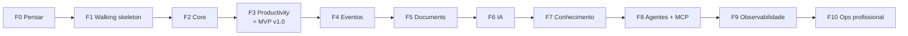

# Roadmap

> Status: **rascunho — CARD-000**. As fases de 0 a 3 estão detalhadas; as fases de 4 em diante são um esboço e **vão mudar**.

Cada fase termina com **algo rodando e usável**. Cada tecnologia entra quando resolve um problema que você já sentiu.

## F0 — Pensar o sistema
*Você aprende:* definição de produto, requisitos, arquitetura, ADRs e modelagem de domínio.

| Card | Título |
|---|---|
| [CARD-000](../cards/CARD-000.md) | Visão do produto e definição arquitetural |
| CARD-001 | Modelo de domínio e bounded contexts (event storming solo e leve) |

## F1 — Walking skeleton
*Você aprende:* Git, Maven, Spring Boot, fronteiras de módulo, Docker, Liquibase, testes e CI.

| Card | Título |
|---|---|
| CARD-002 | Repositório, convenções de commit e estrutura do monorepo |
| CARD-003 | Spring Boot por módulo (package-by-feature) + Spring Modulith/ArchUnit |
| CARD-004 | PostgreSQL no Docker Compose + Liquibase + primeira migration |
| CARD-005 | React + Vite + TypeScript chamando um endpoint real (CORS) |
| CARD-006 | Testes unitários e de integração (Testcontainers) + GitHub Actions (CI) |
| CARD-007 | Primeiro deploy no notebook: Compose, health check, logs estruturados, backup |

✅ **Checkpoint:** um sistema "vazio", mas no ar no seu servidor e com backup.

> A operação mínima (health check, logs, backup, deploy com Compose) entra **já aqui**, e não só nas fases 9 e 10. Assim você pratica "rodar em produção" desde o começo.

## F2 — Core: identidade e segurança
*Você aprende:* REST, DTOs, validação, transações, Spring Security por dentro, JWT e RBAC.

| Card | Título |
|---|---|
| CARD-008 | Users + tratamento de erros padronizado (ProblemDetail) |
| CARD-009 | Senhas e hashing |
| CARD-010 | Autenticação com JWT (filter chain) |
| CARD-011 | Refresh token com rotação, logout, sessões |
| CARD-012 | Autorização: RBAC e method security |
| CARD-013 | Auditoria |

## F3 — Productivity → **MVP v1.0**
*Você aprende:* modelagem, máquina de estados, concorrência, React Query e SQL de verdade.

| Card | Título |
|---|---|
| CARD-014 | Tasks: paginação e filtros |
| CARD-015 | Kanban: transições de status e ordenação, com optimistic locking |
| CARD-016 | Frontend de tasks/Kanban: cache e optimistic updates |
| CARD-017 | Calendar: eventos, fuso horário e recorrência simples |
| CARD-018 | Notes + busca full-text (tsvector) |
| CARD-019 | Dashboard: queries agregadas, views, índices e `EXPLAIN ANALYZE` |

✅ **Checkpoint:** **você passa a usar o LifeHub no dia a dia.** A partir daqui, seus incômodos viram requisitos.

## F4 — Eventos (esboço)
| Card | Título |
|---|---|
| CARD-020 | Eventos de domínio in-process (sentir o problema antes da solução) |
| CARD-021 | RabbitMQ: exchanges, filas, routing keys |
| CARD-022 | Outbox pattern, idempotência, retries e dead-letter queue |
| CARD-023 | Notificações e lembretes por e-mail (Mailpit) |

## F5 — Documents (esboço)
| Card | Título |
|---|---|
| CARD-024 | Upload, armazenamento, metadados e permissões |
| CARD-025 | Extração de texto assíncrona |

## F6 — IA (esboço)
| Card | Título |
|---|---|
| CARD-026 | Spring AI + abstração de provider |
| CARD-027 | Structured output: tarefa a partir de linguagem natural |
| CARD-028 | Tool calling sobre tasks/calendar com autorização |
| CARD-029 | Avaliação de IA: testar o que não é determinístico |

## F7 — Conhecimento (esboço)
| Card | Título |
|---|---|
| CARD-030 | Chunking, embeddings e pgvector |
| CARD-031 | RAG sobre notas e documentos, com citação das fontes |

## F8 — Agentes + MCP (esboço)
| Card | Título |
|---|---|
| CARD-032 | Planner agent com human-in-the-loop |
| CARD-033 | MCP server expondo as ferramentas do LifeHub |

## F9 — Observabilidade completa (esboço)
Prometheus, Grafana, Loki, tracing e alertas.

## F10 — Operação profissional (esboço)
Ansible, CD completo (GitHub Actions → imagem → registry → servidor), Nginx com TLS, firewall, secrets, rollback e backups **testados** (restaurar de verdade).

## Depois — Melhoria contínua
Performance, cache, UX, novos agentes, integrações e automações, sempre guiados por necessidades reais.
