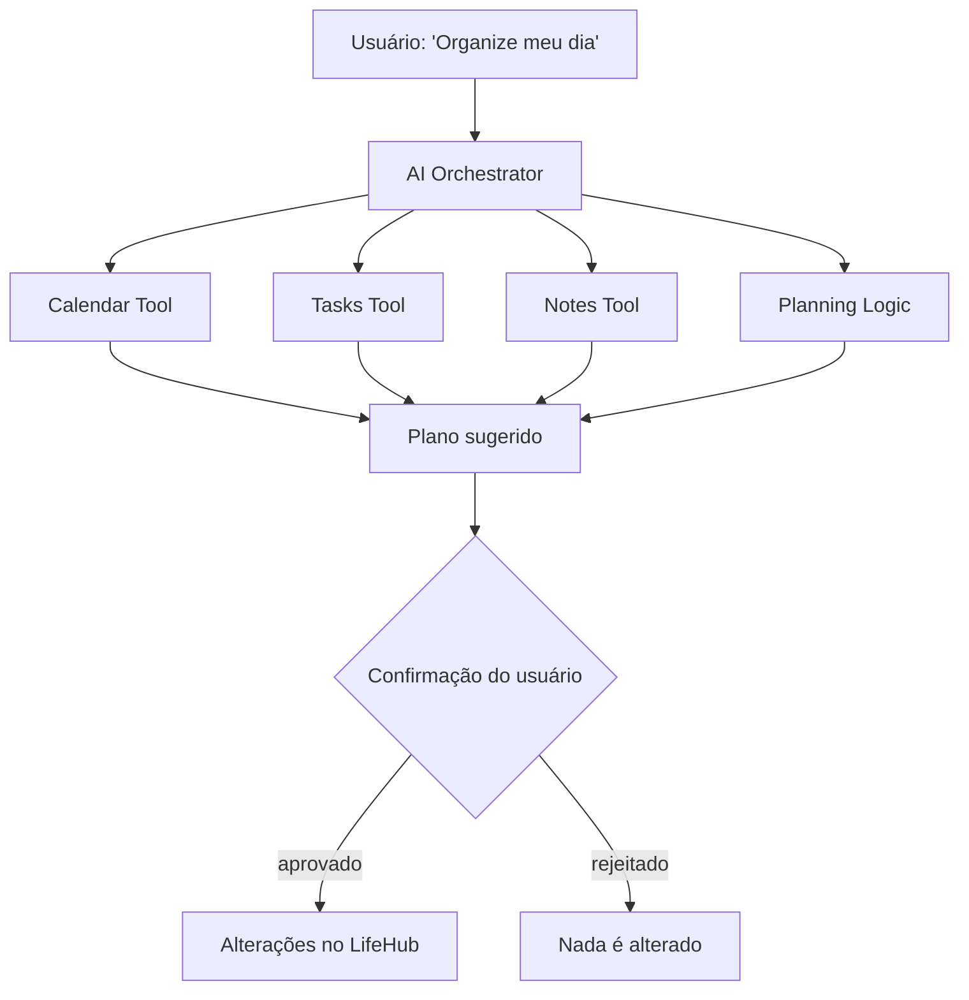

# Visão do Produto

> Status: **rascunho — CARD-000**

## 1. O que é o LifeHub

Uma plataforma pessoal de produtividade e conhecimento, self-hosted, que centraliza tarefas, Kanban, calendário, notas, documentos, lembretes, notificações e dashboard. Futuramente, ela terá um assistente de IA conectado aos próprios dados do usuário.

## 2. Problema

> ✍️ **Pergunta 1 do CARD-000.** Que problema *seu, de hoje*, o LifeHub resolve melhor que Notion, Todoist ou Google Calendar?

**Resposta:** o foco não é um produto inovador. O objetivo é chegar a algo tão bom quanto uma versão menor dessas ferramentas, mas que centralize tudo o que eu preciso, do jeito que eu gosto de usar.

## 3. Usuário

> ✍️ **Pergunta 2 do CARD-000.** Usuário único ou multiusuário?

**Resposta:** multiusuário. Todo dado pertence a um usuário (`user_id`) e fica isolado dos demais. Decisão registrada no [ADR-002](../adr/ADR-002-multiusuario.md).

## 4. Objetivos

### 4.1 Produto
Construir uma aplicação útil no dia a dia para:
- tarefas e Kanban;
- calendário e lembretes;
- notas e documentos;
- notificações e dashboard;
- busca e conhecimento pessoal;
- assistente de IA e agentes especializados.

### 4.2 Aprendizado
Servir como laboratório de engenharia de software: Java, Spring Boot, Spring Security, REST, PostgreSQL/SQL, JPA/Hibernate, Liquibase, Docker, RabbitMQ, React, TypeScript, testes automatizados, arquitetura, DDD, Modular Monolith, segurança, observabilidade, DevOps, Ansible, CI/CD e engenharia de IA (RAG, embeddings, pgvector, tool calling, agentes, MCP).

O projeto privilegia **entendimento e qualidade**, não quantidade de funcionalidades.

## 5. Não-objetivos

O que o LifeHub **explicitamente não é**. Esta lista é tão importante quanto a de objetivos.

- **Finanças pessoais:** removidas do escopo.
- **App mobile:** não haverá app mobile, somente web.
- **Alta escalabilidade:** a aplicação serve apenas para uso pessoal e como portfólio.

## 6. Contexto de execução

O LifeHub roda em infraestrutura própria, inicialmente um notebook antigo na rede doméstica, de forma reproduzível com Docker e, mais tarde, com Ansible.

> ✍️ **Pergunta 3 do CARD-000.** O que acontece quando o notebook desliga? Isso é aceitável?
> O que isso implica para os lembretes (que precisam disparar numa hora exata) e para os backups?

**Resposta:** por enquanto, a aplicação fica hospedada no notebook. Ela será desenvolvida com boas práticas e otimizações para rodar bem nesse hardware limitado. A decisão final sobre a hospedagem (continuar no notebook ou migrar para a nuvem, por exemplo AWS, que também é um objetivo de aprendizado) fica para depois de testes de desempenho na máquina real.

**Quando o notebook desliga:** a indisponibilidade é aceitável, porque o uso é pessoal. O que isso implica:
- **Operação:** o notebook fica ligado o tempo todo, como servidor dedicado.
- **Lembretes:** nenhum lembrete se perde. Ao religar, a aplicação procura os lembretes que venceram enquanto estava desligada e os envia marcados como atrasados.
- **Backups:** `pg_dump` diário, copiado para fora do notebook (PC ou nuvem). Se o disco do notebook morrer, o backup sobrevive. O restore é testado periodicamente.

> ✍️ **Pergunta 10 do CARD-000.** O hardware aguenta rodar um LLM local (Ollama)?
> Levante a RAM, a CPU e se há GPU. Se não aguentar, o que isso muda na fase de IA?

**Resposta:** há duas máquinas:
- **Servidor (notebook):** 8 GB de RAM e Celeron de 2ª geração, sem GPU dedicada. **Não** roda um LLM local de forma utilizável.
- **Desenvolvimento (PC):** 32 GB de RAM, Ryzen 5 5600G e Radeon RX 6600 (8 GB de VRAM). Roda o Ollama durante o desenvolvimento.

**IA no servidor:** em produção, usar um provider na nuvem (OpenAI) por padrão. O Ollama fica no PC para desenvolvimento e testes. A abstração de provider permite trocar um pelo outro só por configuração. Como um provider pago contraria "sem serviços pagos obrigatórios" ([requirements.md §3](requirements.md)), a IA é **opcional**: o LifeHub funciona completo com ela desligada. Antes de ativar o RAG com a nuvem, avaliar quais dados pessoais seriam enviados ao provider. Rever a decisão quando a fase de IA começar ou se a hospedagem migrar para a nuvem.

## 7. Visão da IA

O objetivo não é apenas conversar com um modelo. É construir uma camada capaz de **entender o contexto, consultar dados reais por meio de ferramentas e executar ações controladas**.

## 8. Princípios

1. **Entender antes de abstrair:** nada de abstrações só porque parecem sofisticadas.
2. **Modularidade antes de microservices:** primeiro limites claros, depois (talvez) distribuição.
3. **O banco faz parte da arquitetura:** toda mudança estrutural passa pelo Liquibase.
4. **Código testável:** os testes são proporcionais ao risco.
5. **APIs documentadas:** OpenAPI/Swagger.
6. **Decisões importantes documentadas:** em ADRs.
7. **Assíncrono quando fizer sentido:** RabbitMQ só com necessidade real.
8. **IA com acesso controlado aos dados:** por ferramentas explícitas, não só geração de texto.
9. **Ações de agentes são auditáveis:** mais autonomia exige mais autorização, auditoria, idempotência, confirmação humana e limites de execução.
10. **Evoluir sem reescrever:** ampliar a arquitetura existente em vez de reconstruí-la.

> **Complexidade deve ser conquistada, não adicionada artificialmente.**
