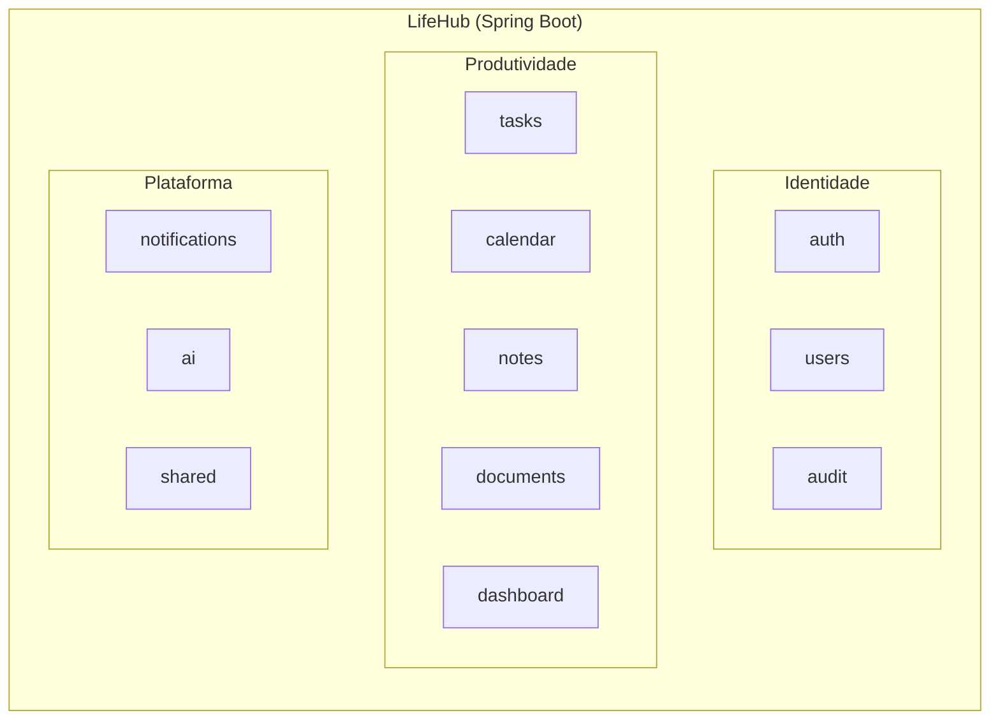
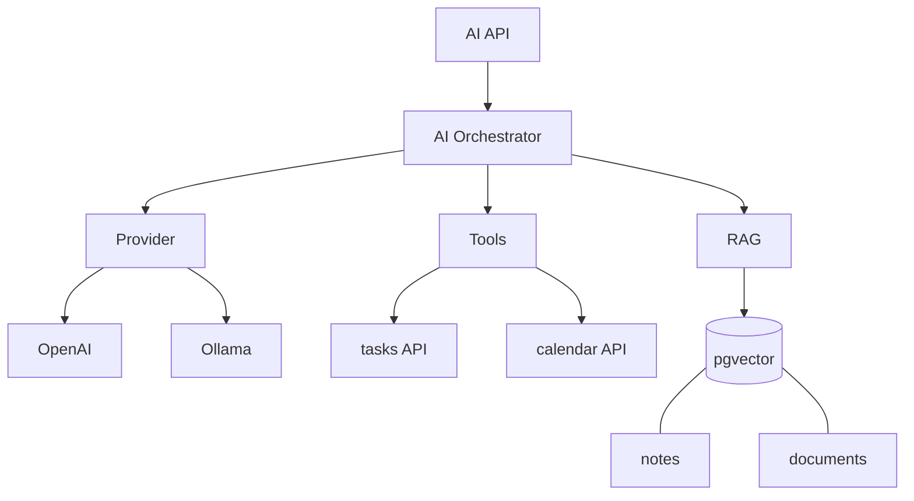

# Arquitetura

> Status: **rascunho — CARD-000**. Decisão principal registrada em [ADR-001](../adr/ADR-001-modular-monolith.md).

## 1. Estilo arquitetural: Modular Monolith

O LifeHub começa como **um único deployable Spring Boot**, organizado internamente em **módulos com limites explícitos**. Um módulo evolui sem depender da implementação interna de outro. Se no futuro houver uma necessidade real de distribuição, um módulo pode ser extraído para um serviço.

### Módulo ≠ camada

```text
❌ Por camada (evitar)          ✅ Por módulo (capacidade de negócio)
com.lifehub                     com.lifehub
├── controller/                 ├── tasks/
├── service/                    │   ├── TaskApi.java        ← API pública do módulo
└── repository/                 │   └── internal/           ← ninguém de fora acessa
                                ├── calendar/
                                ├── notes/
                                └── shared/
```

Cada módulo tem:
- uma **API pública** (interfaces, DTOs e eventos) que os outros módulos podem usar;
- uma parte **interna** (entidades, repositórios, serviços) que ninguém de fora acessa;
- **suas próprias tabelas**. Nenhum outro módulo lê ou escreve nelas diretamente.

> A garantia dessas regras (Spring Modulith ou ArchUnit) entra no CARD-003.

## 2. Visão geral



> O Kanban é tratado como uma **visão** do módulo `tasks` (estado + ordenação), não como um módulo separado. _✍️ Você concorda? Se discordar, justifique._

## 3. Módulos

Para cada módulo, complete a frase: **"Este módulo é dono de ___ e ninguém mais altera ___."**

| Módulo | Responsabilidade | É dono de | Release |
|---|---|---|---|
| `auth` | Login, JWT, refresh tokens, sessões, MFA, recuperação de senha | _✍️_ | MVP / Security |
| `users` | Usuários e suas configurações | _✍️_ | MVP |
| `tasks` | Tarefas: prioridade, prazo, etiquetas, status (Kanban) | _✍️_ | MVP |
| `calendar` | Eventos, compromissos, lembretes | _✍️_ | MVP |
| `notes` | Notas pessoais e conhecimento | _✍️_ | MVP |
| `dashboard` | Visão agregada do dia | _✍️_ | MVP |
| `audit` | Registro de ações relevantes (humanas e de agentes) | _✍️_ | Security |
| `notifications` | Notificações internas e externas (e-mail) | _✍️_ | Messaging |
| `documents` | Upload, metadados, extração, chunks | _✍️_ | Documents |
| `ai` | Providers, orquestração, tools, RAG, agentes | _✍️_ | AI |
| `shared` | Tipos e utilitários técnicos comuns (sem regras de negócio) | — | Foundation |

> ⚠️ **Armadilha:** `shared` vira depósito de tudo. Regra: se tem regra de negócio, não é `shared`.

## 4. Dependências permitidas

> ✍️ **Perguntas 4 a 7 do CARD-000.** Responda antes de preencher a matriz.
> - Uma tarefa com data é um evento do calendário? Um lembrete pertence a Tasks, Calendar ou Notifications?
> - Notes pode referenciar Tasks? Em que direção vai a dependência?
> - O Dashboard lê as tabelas dos outros módulos ou chama as APIs públicas deles?
> - Como evitar que `ai` vire o "módulo Deus" que depende de todos?

Marque ✅ onde o módulo da **linha** pode depender do módulo da **coluna**. Não pode haver ciclos.

| depende de → | users | tasks | calendar | notes | documents | audit | notifications |
|---|---|---|---|---|---|---|---|
| **auth** | | | | | | | |
| **tasks** | | — | | | | | |
| **calendar** | | | — | | | | |
| **notes** | | | | — | | | |
| **dashboard** | | | | | | | |
| **notifications** | | | | | | | — |
| **ai** | | | | | | | |

### Formas de comunicação entre módulos
1. **Chamada síncrona à API pública** (interface Java): simples, mas cria acoplamento em tempo de execução.
2. **Eventos de domínio** (in-process e, depois, RabbitMQ): o módulo emissor não conhece quem reage.

_✍️ Qual você usa em cada relação acima, e por quê?_

## 5. Stack

| Camada | Tecnologias |
|---|---|
| Backend | Java 21, Spring Boot, Spring Security, Spring Data JPA/Hibernate, Bean Validation, Maven, Spring AI |
| Frontend | React, TypeScript, React Query, Material UI |
| Banco | PostgreSQL, Liquibase, PL/pgSQL, pgvector |
| Mensageria | RabbitMQ |
| Infra | Docker, Docker Compose, Nginx, Ansible |
| CI/CD | GitHub Actions |
| Observabilidade | Actuator, Prometheus, Grafana, Loki |
| IA | Spring AI, OpenAI, Ollama, embeddings, RAG, tool calling, agentes, MCP |

> Como o banco é PostgreSQL, a lógica procedural usa **PL/pgSQL**, e não PL/SQL (que é do Oracle).

## 6. Arquitetura da IA (visão futura)



- **Provider abstraction:** o restante da aplicação não conhece o fornecedor do modelo.
- **Tools chamam as APIs públicas dos módulos**, nunca os repositórios deles. Assim, as regras e a autorização continuam valendo.
- **Ações destrutivas** exigem autorização da tool, confirmação humana, auditoria e idempotência.

## 7. Segurança (transversal)

Autenticação, autorização (RBAC), hashing de senhas, JWT, refresh tokens, MFA, controle de sessão, validação de entrada, proteção de APIs, gestão de secrets, HTTPS/TLS, firewall, backups, auditoria e menor privilégio. Atenção especial às ferramentas de IA capazes de alterar dados.

## 8. Qualidade e testes

A estratégia evolui com o sistema: testes unitários, de integração (Testcontainers), de repositório, de API, de contrato, de segurança, de mensageria e de carga, sempre proporcionais ao risco.

## 9. Evolução

> ✍️ **Pergunta 9 do CARD-000.** Que sinal concreto justificaria extrair um módulo para um microservice?

_Resposta:_
