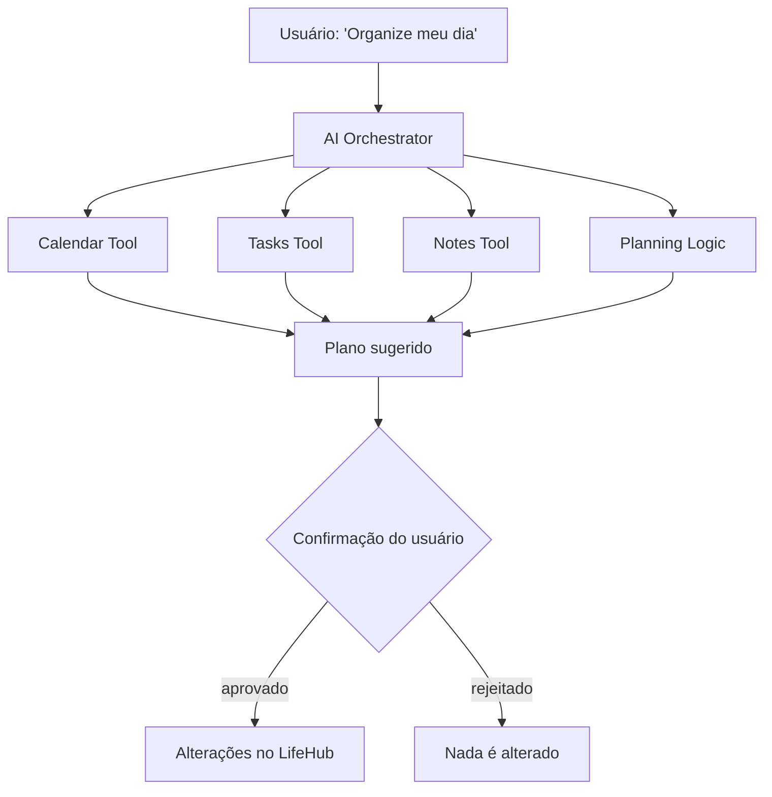

# Visão do Produto

> Status: **rascunho — CARD-000**

## 1. O que é o LifeHub

Uma plataforma pessoal de produtividade e conhecimento, self-hosted, que centraliza tarefas, Kanban, calendário, notas, documentos, lembretes, notificações e dashboard. Futuramente, ela terá um assistente de IA conectado aos próprios dados do usuário.

## 2. Problema

> ✍️ **Pergunta 1 do CARD-000.** Que problema *seu, de hoje*, o LifeHub resolve melhor que Notion, Todoist ou Google Calendar?
> Se a resposta honesta for "nenhum, o objetivo principal é aprender", escreva isso. Essa resposta muda as prioridades de tudo o que vem depois.

_Resposta:_

## 3. Usuário

> ✍️ **Pergunta 2 do CARD-000.** Usuário único ou multiusuário?
> Essa é a decisão mais cara de mudar depois. Ela afeta o modelo de dados (toda tabela tem `user_id`?), o RBAC, a auditoria e o isolamento de dados no RAG. Se for relevante, registre a decisão num ADR-002.

_Resposta:_

## 4. Objetivos

### 4.1 Produto
Construir uma aplicação útil no dia a dia para:
- tarefas e Kanban;
- calendário e lembretes;
- notas e documentos;
- notificações e dashboard;
- busca e conhecimento pessoal;
- assistente de IA e agentes especializados.

### 4.2 Aprendizado
Servir como laboratório de engenharia de software: Java, Spring Boot, Spring Security, REST, PostgreSQL/SQL, JPA/Hibernate, Liquibase, Docker, RabbitMQ, React, TypeScript, testes automatizados, arquitetura, DDD, Modular Monolith, segurança, observabilidade, DevOps, Ansible, CI/CD e engenharia de IA (RAG, embeddings, pgvector, tool calling, agentes, MCP).

O projeto privilegia **entendimento e qualidade**, não quantidade de funcionalidades.

## 5. Não-objetivos

O que o LifeHub **explicitamente não é**. Esta lista é tão importante quanto a de objetivos.

- **Finanças pessoais:** removidas do escopo.
- _✍️ Complete: o que mais fica de fora? Colaboração em equipe? App mobile nativo? Acesso pela internet ou só na rede local?_

## 6. Contexto de execução

O LifeHub roda em infraestrutura própria, inicialmente um notebook antigo na rede doméstica, de forma reproduzível com Docker e, mais tarde, com Ansible.

> ✍️ **Pergunta 3 do CARD-000.** O que acontece quando o notebook desliga? Isso é aceitável?
> O que isso implica para os lembretes (que precisam disparar numa hora exata) e para os backups?

_Resposta:_

> ✍️ **Pergunta 10 do CARD-000.** O hardware aguenta rodar um LLM local (Ollama)?
> Levante a RAM, a CPU e se há GPU. Se não aguentar, o que isso muda na fase de IA?

_Resposta:_

## 7. Visão da IA

O objetivo não é apenas conversar com um modelo. É construir uma camada capaz de **entender o contexto, consultar dados reais por meio de ferramentas e executar ações controladas**.

## 8. Princípios

1. **Entender antes de abstrair:** nada de abstrações só porque parecem sofisticadas.
2. **Modularidade antes de microservices:** primeiro limites claros, depois (talvez) distribuição.
3. **O banco faz parte da arquitetura:** toda mudança estrutural passa pelo Liquibase.
4. **Código testável:** os testes são proporcionais ao risco.
5. **APIs documentadas:** OpenAPI/Swagger.
6. **Decisões importantes documentadas:** em ADRs.
7. **Assíncrono quando fizer sentido:** RabbitMQ só com necessidade real.
8. **IA com acesso controlado aos dados:** por ferramentas explícitas, não só geração de texto.
9. **Ações de agentes são auditáveis:** mais autonomia exige mais autorização, auditoria, idempotência, confirmação humana e limites de execução.
10. **Evoluir sem reescrever:** ampliar a arquitetura existente em vez de reconstruí-la.

> **Complexidade deve ser conquistada, não adicionada artificialmente.**
