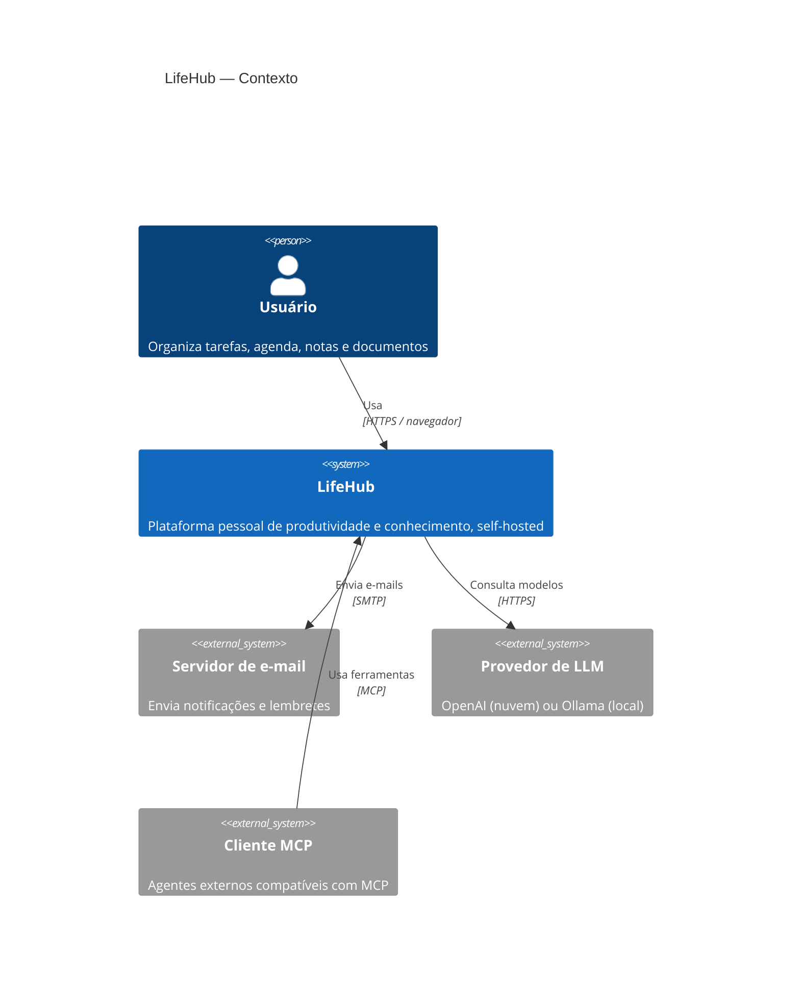
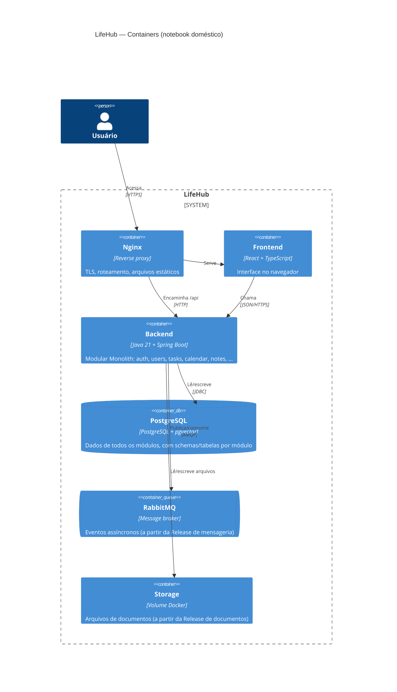

# Diagramas C4

> Status: **rascunho — CARD-000**. Só os níveis 1 e 2 por enquanto. Os níveis 3 (componentes) e 4 (código) só entram quando houver código.

## Nível 1 — Contexto do sistema

Quem usa o LifeHub e com quais sistemas externos ele conversa.

> ✍️ **Revise:** algum sistema externo está faltando ou sobrando para o MVP? (Dica: no MVP, *nenhum* sistema externo é obrigatório.)

**Resposta:** o diagrama mostra a visão completa. Nenhum desses sistemas externos é necessário no MVP: o servidor de e-mail entra na release de mensageria, o provedor de LLM na de IA e o cliente MCP na de agentes. Não falta nenhum sistema.

## Nível 2 — Containers

Os processos e armazenamentos que compõem o LifeHub.

### O que existe em cada momento

| Container | MVP | Depois |
|---|---|---|
| Frontend, Backend, PostgreSQL | ✅ | |
| Nginx | opcional | TLS na Release de deploy |
| RabbitMQ | | Release de mensageria |
| Storage | | Release de documentos |
| Prometheus, Grafana, Loki | | Release de observabilidade |

> ✍️ **Pergunta de reflexão:** um banco único com tabelas separadas por módulo ou um *schema* PostgreSQL por módulo? Qual dos dois torna a regra "ninguém mexe nas tabelas dos outros" mais fácil de verificar?

**Resposta:** um banco único com um *schema* por módulo (`tasks.task`, `calendar.event`...). O dono de cada tabela fica explícito no nome, é fácil procurar no código referências a um schema de outro módulo, e cada módulo pode ter os próprios changelogs do Liquibase. Se no futuro um módulo for extraído, o schema dele sai inteiro.
