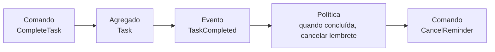

# Estudo — CARD-001

Guia de apoio para o [CARD-001 — Modelo de Domínio e Bounded Contexts](../cards/CARD-001.md).

- A **Parte 1** resume os conceitos que o card pede para estudar, com exemplos do LifeHub.
- A **Parte 2** apoia cada uma das 12 perguntas: o que considerar, as opções e o que cada uma implica. **Não traz a resposta**: a decisão é sua, e vai para os documentos em `docs/domain/`.
- A **Parte 3** fica para depois: o que você aprendeu e por quê, como no [estudo do CARD-000](CARD-000.md).

---

# Parte 1 — Conceitos

## Linguagem ubíqua
Um termo, **um significado**, usado igual na conversa, nos documentos e no código. Se no documento está "concluir a tarefa" e no código está `task.setStatus(DONE)`, a linguagem já se perdeu.

> 💡 **Teste rápido:** leia um trecho de código em voz alta. Se soa como uma frase que você diria sobre o seu dia ("a tarefa foi reagendada"), a linguagem está boa. Se soa como banco de dados ("atualizou o campo status"), não está.

## Subdomínios: core, suporte e genérico
| Tipo | O que é | Onde investir |
|---|---|---|
| **Core** | O que torna o LifeHub o LifeHub. É o motivo de ele existir. | Seu melhor esforço de modelagem |
| **Suporte** | Necessário e específico do LifeHub, mas não é o diferencial | Modelagem simples |
| **Genérico** | Todo sistema tem (login, envio de e-mail) | Usar pronto: biblioteca ou framework |

> 💡 Num projeto de estudo, "onde rende mais aprendizado" também pesa. Mas vale separar as duas coisas: *o que é core para o produto* e *o que eu quero praticar*.

## Bounded context × módulo
- **Bounded context** é uma fronteira **de linguagem**: dentro dela, cada termo tem um significado só.
- **Módulo** é uma fronteira **de código**: um pacote com API pública e parte interna.

Nem sempre é 1:1. Um contexto "Identidade" pode ter os módulos `auth` e `users`; um módulo nunca deve misturar dois contextos.

> 💡 **Sinal de dois contextos:** a mesma palavra muda de sentido. "Usuário" em `auth` é quem tem credenciais; em `tasks`, é só o dono dos dados (`UserId`).

## Entidade × value object
| | Entidade | Value object |
|---|---|---|
| Identidade | Tem (um ID) | Não tem |
| Igualdade | Duas entidades são iguais se o ID for igual | Dois VOs são iguais se os **valores** forem iguais |
| Mudança | Muda ao longo do tempo e continua sendo "a mesma" | Imutável: para mudar, cria outro |
| Exemplo | `Task` | `TaskId`, `DueDate`, `Priority`, `Email` |

> 💡 `TaskId` é um value object que **carrega** a identidade de uma entidade. Usar `TaskId` em vez de `UUID` impede, em tempo de compilação, passar o ID de uma nota onde se espera o de uma tarefa. Em Java 21, `record` é o jeito natural de escrever VOs.

## Agregado e raiz do agregado
Um **agregado** é um grupo de objetos que precisa estar **consistente ao mesmo tempo**. A **raiz** é a única porta de entrada: ninguém de fora altera as partes internas diretamente.

Regras práticas (Vaughn Vernon, "Effective Aggregate Design"):
1. **Proteja as invariantes dentro do agregado.** A fronteira é definida pelas regras, não pelas tabelas.
2. **Prefira agregados pequenos.** Agregado grande significa mais conflito de concorrência e mais dado carregado à toa.
3. **Referencie outros agregados pelo ID**, nunca pelo objeto.
4. **Uma transação altera um agregado.** Consistência entre agregados é **eventual**, por eventos.

> 💡 **A pergunta que acha o agregado:** "o que precisa estar consistente **imediatamente**, na mesma transação?" O resto pode chegar por evento.

## Invariante
Algo que é verdade **sempre**, não "na maioria das vezes". Exemplos: "o fim de um compromisso não vem antes do início"; "uma tarefa pertence a exatamente um usuário".

> 💡 Se a invariante só é verificada no controller ou no service, ela não é protegida: qualquer outro caminho de código pode quebrá-la. O lugar dela é **dentro do agregado**, no método que muda o estado (`complete()`, `reschedule()`).

## Eventos de domínio
Algo que **aconteceu** e importa para o negócio, nomeado **no passado**: `TaskCompleted`, `TaskRescheduled`. Não é um comando (`CompleteTask`) nem uma ação de tela ("clicou em salvar").

Tudo o que aprendemos no CARD-000 vale aqui:
- eventos dizem **o que mudou**; jobs agendados dizem **que horas são**;
- o emissor não sabe quem reage;
- o payload precisa bastar para o consumidor, sem que ele tenha de chamar o emissor de volta (pergunta 8).

## Event storming solo e leve
Ordem sugerida, com post-its ou uma lista:
1. **Eventos** (laranja): tudo o que acontece no MVP, no passado, sem ordem.
2. **Linha do tempo:** ordene os eventos numa segunda-feira de manhã típica.
3. **Comandos** (azul): para cada evento, "que ação causou isso?".
4. **Agregados** (amarelo): "quem recebeu o comando e protegeu as regras?".
5. **Políticas** (lilás): "quando X acontece, então Y". Normalmente é aqui que aparecem os consumidores de eventos.

## Context map
Descreve **como os contextos se relacionam**:

| Relação | Significado | Exemplo possível |
|---|---|---|
| **Customer/Supplier** | O fornecedor (upstream) atende às necessidades do cliente (downstream) | `tasks` fornece dados ao `dashboard` |
| **Conformist** | O downstream aceita o modelo do upstream como ele é | `dashboard` usa os DTOs de `tasks` sem traduzir |
| **Anti-corruption layer (ACL)** | O downstream traduz o modelo externo para o seu, para não ser contaminado | `ai` traduzindo a resposta do provider de LLM |
| **Published language** | Um formato bem documentado de troca | Os eventos de domínio publicados por `tasks` |

---

# Parte 2 — Apoio às perguntas

Para cada pergunta: **o que considerar**, **opções e consequências**, e **o que já foi decidido** e restringe a resposta.

## Linguagem

### 1. "Evento": compromisso do calendário × evento de domínio
**O que considerar:** a ambiguidade vai aparecer em lugares reais: `calendar` **publica eventos de domínio sobre eventos do calendário**. Algo como `EventCreatedEvent` é ilegível.

**Opções:**
- Renomear o termo **do calendário**: "compromisso" / `Appointment`, ou "agenda" / `CalendarEntry`.
- Renomear o termo **técnico**: "fato de domínio", "mensagem"... Menos comum; vai contra o vocabulário que você vai encontrar em livros e no Spring (`ApplicationEvent`).
- Manter os dois nomes com um prefixo obrigatório. É frágil, porque depende de disciplina.

**Pergunta-teste:** escreva o nome do evento de domínio "um compromisso foi remarcado" com a sua escolha. Soa natural?

**Já decidido:** os documentos atuais usam "evento" para o calendário ([architecture.md §3](../architecture/architecture.md), [requirements.md US-11 a US-13](../architecture/requirements.md)). Se o termo mudar, esses documentos mudam junto, e isso também vale registrar.

### 2. O que é um "prazo"?
**O que considerar:**
- **Data** (`LocalDate`, "sexta-feira"): o que a maioria das pessoas quer dizer com "para sexta". Não tem hora nem fuso.
- **Instante** (`Instant`, "sexta às 14h UTC"): um ponto exato no tempo.
- **Data e hora local + fuso** (`LocalDateTime` + `ZoneId`): "sexta às 14h no horário de São Paulo".

**Consequências:**
- Se o prazo é uma **data**, "vence" quando? À meia-noite do fuso **do usuário**, lido de `users` na hora de calcular. Um usuário que viaja vê a tarefa vencer no novo fuso.
- Se o prazo é um **instante**, ele não muda quando o usuário viaja, mas "tarefa para sexta" vira "sexta às 00h de algum fuso", o que costuma surpreender.
- Uma tarefa pode ter as duas coisas (data obrigatória, hora opcional), e o modelo precisa deixar isso explícito.

**Já decidido:** US-11 diz "horários salvos em UTC e exibidos no fuso do usuário" para **compromissos**. A pergunta é se tarefas seguem a mesma regra. Lembre-se também de que `notifications` precisa de um **instante** para agendar o lembrete: alguém converte data → instante, e esse alguém precisa conhecer o fuso.

> ⚠️ "Hoje" também depende do fuso. A US-05 ("tarefas do dia") e o dashboard precisam saber qual é o "hoje" do usuário.

## Agregados e invariantes

### 3. Invariantes de `Task`
Cada resposta vira um método e um teste. Para cada pergunta do card, pense no **uso real**:

| Pergunta | Se "sim" | Se "não" |
|---|---|---|
| Concluída pode voltar para TODO? | Precisa de um comando `reopen()` e de um evento `TaskReopened`. O lembrete volta? | Erro ao concluir por engano não tem desfazer |
| Criar com prazo no passado? | Útil para registrar algo atrasado | Mas "passado" depende do fuso (pergunta 2), e o servidor pode estar com relógio diferente |
| Editar depois de concluída? | Simples | Histórico mais confiável; exige reabrir para corrigir |

> 💡 **Formato útil para o `aggregates.md`:** "Uma tarefa concluída **não pode** ser concluída de novo" → `should_not_complete_task_already_done`.

### 4. Etiqueta: agregado próprio ou value object?
| | Value object dentro de `Task` | Agregado próprio (`Tag`, com `TagId`) |
|---|---|---|
| Renomear "trabalho" | Precisa alterar **todas** as tarefas: N agregados, contra a regra de uma transação por agregado | Altera **um** agregado; as tarefas guardam só o `TagId` |
| Cor, ícone, descrição | Repetidos em cada tarefa | Guardados uma vez |
| Autocompletar etiquetas existentes | Consulta de todos os valores distintos | Lista direta de `Tag` |
| Simplicidade | Maior | Menor: mais um agregado, mais uma API |

**Pergunta-teste:** "Para você, uma etiqueta **existe** antes de ser usada numa tarefa?" Se sim, ela tem identidade, e isso aponta para agregado.

**Já decidido:** US-08 diz que o filtro por etiqueta combina com paginação. Pense em como cada modelo vira consulta no CARD-014.

### 5. A ordem no Kanban pertence a quem?
É a pergunta mais difícil do card, porque mexe com concorrência (CARD-015).

| Opção | Mover um card | Concorrência |
|---|---|---|
| **Posição inteira em cada `Task`** (1, 2, 3...) | Reordena os vizinhos: altera **N** agregados numa transação | Conflitos entre tarefas diferentes da mesma coluna |
| **Agregado `Board`/`Column`** com a lista ordenada de `TaskId` | Altera **um** agregado | Toda movimentação na coluna disputa o mesmo agregado (ponto de contenção) |
| **Posição fracionária** ou lexicográfica em cada `Task` (ex.: entre 1.0 e 2.0, grava 1.5) | Altera **só a tarefa movida** | Conflito só se duas pessoas moverem a mesma tarefa |

A terceira opção é a que ferramentas como Trello e Jira usam ("lexorank"). O custo é que, depois de muitas inserções no mesmo lugar, as posições precisam ser **rebalanceadas** de vez em quando.

**Perguntas-teste:**
- Numa aplicação multiusuário **sem compartilhamento** (ADR-002), quantas pessoas movem cards do mesmo quadro ao mesmo tempo? Isso muda o peso da contenção?
- Status e posição mudam juntos quando o card troca de coluna. Eles pertencem ao mesmo agregado?

**Já decidido:** o Kanban é uma **visão** de `tasks`, e status e ordem são atributos da tarefa ([architecture.md §2](../architecture/architecture.md)). Se você escolher `Board`, isso muda uma decisão do CARD-000 e vira ADR.

### 6. Por que `Task` guarda só o `UserId`?
**Para pensar sobre o que quebraria se guardasse o objeto `User`:**
- **Fronteira de módulo:** `tasks` passaria a depender da classe interna de `users`, contra a matriz ([architecture.md §4](../architecture/architecture.md)).
- **Consistência:** alterar a tarefa carregaria e poderia "sujar" o usuário: dois agregados na mesma transação.
- **Desempenho:** carregar uma tarefa arrastaria o usuário (e talvez tudo o que ele referencia).
- **Extração futura:** se `users` virar um serviço, o objeto deixa de existir no mesmo processo; o ID continua funcionando.

> 💡 Na JPA, isso significa **não** usar `@ManyToOne User owner` entre módulos, e sim uma coluna `user_id` mapeada como `UserId`.

### 7. Exclusão: hard delete ou soft delete?
| | Hard delete | Soft delete (`deleted_at`) |
|---|---|---|
| Dados | Somem de verdade | Continuam no banco |
| Consultas | Simples | **Toda** consulta precisa filtrar `deleted_at is null`; fácil de esquecer |
| Desfazer | Impossível | Possível ("lixeira") |
| Privacidade | Excluir é excluir | O usuário pediu para apagar, mas o dado continua lá |

**Siga o efeito em cadeia, porque é isso que o card quer ver:**
- **Lembrete:** um evento `TaskDeleted` faz `notifications` cancelar o lembrete (política).
- **Auditoria:** o registro de auditoria **nunca** é apagado (é "só inclusão", [architecture.md §3](../architecture/architecture.md)). Então ele guarda o quê: só o `TaskId`, ou um retrato do que foi apagado?
- **Notas que citam a tarefa (pós-MVP):** o link quebra, mostra "tarefa excluída" ou impede a exclusão? Lembre-se de que a dependência é `notes → tasks`, e `tasks` não sabe que foi citada.

## Eventos e lembretes

### 8. Eventos de domínio do MVP e o payload mínimo
**Tabela sugerida para o `event-storming.md`:**

| Evento | Publicador | Consumidores | Payload |
|---|---|---|---|
| `TaskCreated` | `tasks` | `notifications`, `audit`? | ? |
| ... | | | |

**Para achar o payload mínimo**, pergunte o que `notifications` precisa para agendar **sem chamar `tasks` de volta**:
- qual lembrete (o ID da tarefa);
- para quem (o `UserId`);
- quando disparar (um **instante**, ou uma data mais o fuso; ver pergunta 2);
- o que mostrar na notificação (o título da tarefa?).

> ⚠️ **Armadilha:** se o título vai no evento e o usuário renomeia a tarefa, o lembrete mostra o título antigo, a menos que exista um `TaskRenamed` (ou similar) que `notifications` também escute. Cada campo no payload é um compromisso de manter a cópia atualizada.

**Critério de aceite relacionado:** todo evento tem publicador e pelo menos um consumidor, ou está marcado como "futuro". Um evento sem consumidor no MVP é um candidato a não existir ainda.

**Já decidido:** `notifications` agenda os lembretes a partir dos eventos de `tasks` e `calendar` ([architecture.md §4, pergunta 4](../architecture/architecture.md)). Os eventos precisam cobrir criação, alteração de prazo, conclusão e exclusão.

### 9. Quem é dono de "me avise 15 minutos antes"?
| Opção | Implicação |
|---|---|
| **Atributo da tarefa/compromisso** (quem cria decide) | `tasks` e `calendar` conhecem o conceito de lembrete; o evento carrega "avisar X minutos antes" |
| **Atributo do lembrete** (`notifications`) | `tasks` não sabe nada de avisos; mas como o usuário escolhe "15 min" ao criar a tarefa, se a tela de criação pertence a `tasks`? |
| **Preferência do usuário** ("sempre 15 min antes") | Mais simples no MVP; vive em `users` ou em `notifications` |

**Sobre mudar o prazo:** qualquer que seja a escolha, a pergunta é qual evento avisa `notifications`. Com `TaskRescheduled` no payload certo, `notifications` recalcula a hora de disparo sozinho.

## Contextos

### 10. `auth` e `users`: um contexto ou dois?
**Sinais de que são um contexto só ("Identidade"):**
- o login precisa dos dois (e-mail em `users`, senha em `auth`) para funcionar;
- "usuário" significa a mesma coisa nos dois.

**Sinais de que são dois:**
- `auth` pode mudar de mecanismo (senha → OAuth, MFA) sem que `users` mude;
- `users` guarda dados de perfil (fuso, preferências) que não têm nada a ver com autenticação.

**Onde a senha mora:** o hash da senha é uma **credencial**. Se ficar em `users`, `users` precisa conhecer hashing e segurança; se ficar em `auth`, o cadastro atravessa dois módulos (cria o usuário **e** a credencial). Veja também como o Spring Security modela isso (`UserDetailsService`): ele espera receber, de um lugar só, o nome de usuário, a senha e os papéis.

**Já decidido:** a matriz diz `auth → users` pela API ([architecture.md §4](../architecture/architecture.md)), e o [ADR-003](../adr/ADR-003-cadastro-aberto.md) criou os papéis ADMIN e USER. Mudar o limite exige um novo ADR (está nas decisões do card).

### 11. Qual é o subdomínio core?
**Perguntas para chegar lá:**
- Se o LifeHub perdesse esse pedaço, ele deixaria de ser o LifeHub?
- Onde estão as regras mais interessantes (e os bugs mais prováveis)? Dica: o card aponta para prazos, fuso horário e ordenação.
- O que é genérico a ponto de usar pronto? Autenticação (Spring Security), envio de e-mail (Spring Mail), auditoria técnica.

**Já decidido:** a [visão](../architecture/vision.md) diz que o LifeHub é um hub que centraliza tarefas, calendário e notas "do jeito que eu gosto de usar". Onde está esse "jeito"?

### 12. O resultado bate com a matriz do CARD-000?
**Checklist para comparar:**
- Algum evento novo cria uma dependência que não está na matriz (por exemplo, `notifications` precisando de `users` para o fuso)?
- Algum agregado novo (`Tag`, `Board`) muda o dono de algum dado na tabela de módulos?
- `auth` e `users` continuam separados?
- Continua sem ciclos?

Se o modelo mudou algo, **a matriz muda** (o modelo é a fonte da verdade; a matriz é a consequência). Mas registre por que mudou.

---

# Parte 3 — O que aprendi (preencher ao longo do card)

## Decisões e por quê
_Para cada pergunta, a decisão tomada e o motivo em uma ou duas linhas._

## Insights
_O que surpreendeu, o que mudou em relação ao CARD-000._

## Dúvidas para o review
_O que ficou incerto e vale perguntar na revisão técnica._

