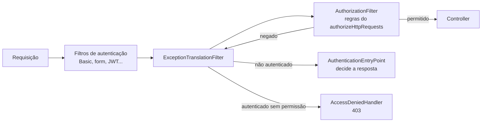

# Estudo — CARD-003

Guia de apoio para o [CARD-003 — Backend por módulo + verificação dos limites](../cards/CARD-003.md).

- A **Parte 1** resume os conceitos do card, com exemplos do LifeHub.
- A **Parte 2** apoia cada pergunta: o que considerar, as opções e onde investigar. **Não traz a resposta.**
- A **Parte 3** é sua: o que aprendeu, incluindo a mensagem de erro da T5.

---

# Parte 1 — Conceitos

## Starters no Spring Boot 4
No CARD-000 você viu que **cada dependência ativa comportamento** (auto-configuração). No Boot 4, os starters ficaram mais granulares:
- o starter web passou a se chamar `spring-boot-starter-webmvc` (existe também o `webflux`, reativo);
- cada tecnologia tem **o próprio starter de teste**: `spring-boot-starter-webmvc-test`, `spring-boot-starter-security-test`...

> 💡 Se uma anotação de teste "sumiu" (como `@AutoConfigureMockMvc`), o motivo costuma ser o starter de teste que falta, não um import errado. No Boot 4, várias dessas anotações também mudaram de pacote.

## Spring Boot Actuator
Endpoints de **operação**, não de produto: `health`, `info`, `metrics`, `env`, `loggers`, `heapdump`...

Dois conceitos que se confundem:
- **Habilitado** (*enabled*): o endpoint existe na aplicação.
- **Exposto** (*exposed*): o endpoint é acessível por um canal (HTTP ou JMX).

> 💡 Antes de configurar, descubra o que o Boot expõe **por padrão** via HTTP. Talvez a configuração explícita só confirme o padrão, e ainda assim valha pela clareza.

## O que o Spring Security faz sem configuração
Com o starter no classpath e nenhuma configuração sua:
- **todas** as rotas exigem autenticação;
- existe um usuário em memória, com uma senha gerada a cada inicialização e impressa no log;
- formulário de login e HTTP Basic vêm habilitados.

Quando você declara o **seu** `SecurityFilterChain`, a configuração padrão da cadeia **sai de cena**, e só vale o que você escreveu.

## A filter chain e quem decide a resposta de erro
Toda requisição passa por uma cadeia de filtros antes de chegar ao controller. Para este card, importam dois papéis:



- **`AuthorizationFilter`** aplica as regras que você escreveu (`permitAll`, `authenticated`).
- **`ExceptionTranslationFilter`** captura a negação e decide o que fazer.
- **`AuthenticationEntryPoint`** é quem responde quando o usuário **não está autenticado**. Qual entry point existe depende dos mecanismos que você habilitou na cadeia.

## 401 × 403
| Código | Nome oficial | Significado real |
|---|---|---|
| **401** | Unauthorized | "Não sei quem você é." Deveria vir com o cabeçalho `WWW-Authenticate`, dizendo como se autenticar. |
| **403** | Forbidden | "Sei quem você é (ou não importa), e você não pode." |

> ⚠️ O nome "Unauthorized" do 401 é histórico e enganoso: ele trata de **autenticação**, não de autorização.

## Spring Modulith
- Cada **subpacote direto** do pacote da classe `@SpringBootApplication` é um **módulo** (`br.com.lifehub.tasks`).
- Os tipos no pacote raiz do módulo formam a **API pública**. Subpacotes (`tasks.internal`) são **internos** por padrão.
- `ApplicationModules.of(LifehubApplication.class).verify()` falha se houver **ciclos** entre módulos ou acesso a tipos internos de outro módulo.
- `@ApplicationModule` (em `package-info.java`) permite configurar cada módulo. Investigue os atributos dele.
- `@NamedInterface` expõe um subpacote como parte da API.
- Também traz testes por módulo (`@ApplicationModuleTest`), suporte a eventos e geração de documentação (`Documenter`).

## ArchUnit
Biblioteca de testes de arquitetura em JUnit. Você **escreve** as regras:

```java
// formato de uma regra, não a sua solução
noClasses().that().resideInAPackage("..X..")
    .should().dependOnClassesThat().resideInAPackage("..Y..");

slices().matching("br.com.lifehub.(*)..").should().beFreeOfCycles();
```

Não conhece o conceito de "módulo" do Spring: você define o que é módulo, API e interno.

## `package-info.java`
Um arquivo especial que documenta e anota o **pacote** (não uma classe):

```java
/**
 * Descrição do pacote.
 */
@AlgumaAnotacao
package br.com.lifehub.exemplo;

import ...;
```

Ele também faz o pacote existir no Git: diferentemente de uma pasta vazia, um pacote com `package-info.java` é versionado.

---

# Parte 2 — Apoio às perguntas

### 1. Spring Modulith ou ArchUnit?
| | Spring Modulith | ArchUnit |
|---|---|---|
| Conceito de módulo | Embutido (subpacote direto = módulo) | Você define |
| Ciclos e acesso a internos | Verificados por padrão | Regras que você escreve |
| A sua matriz (quem pode depender de quem) | Investigue `@ApplicationModule` | Uma regra por relação proibida (ou permitida) |
| Além da verificação | Eventos entre módulos, testes por módulo, documentação | Só verificação |
| Acoplamento ao Spring | Sim | Nenhum |

**Para decidir:**
- Escreva, para cada opção, como ficaria a regra "**ninguém** depende de `dashboard`". Qual é mais curta e mais legível?
- O CARD-020 (eventos in-process) e o CARD-013 (auditoria) podem se beneficiar de algo do Modulith?
- **Compatibilidade:** o Modulith tem uma linha de versões compatível com cada versão do Boot. Confira a tabela no site do projeto antes de escolher a versão; prefira importar o BOM do Modulith.

### 2. Por que tudo passa a pedir login?
**Onde investigar:**
- Leia o log da inicialização e encontre a linha com a senha gerada. **Qual classe** a imprimiu?
- Procure, na documentação do Spring Boot, a auto-configuração de segurança que cria esse usuário e **em que condição** ela deixa de criá-lo.
- Por que a senha muda a cada inicialização? Que problema isso evita?

### 3. 401 ou 403?
**Como chegar à resposta pelo mecanismo, não pelo teste:**
1. Liste os mecanismos de autenticação que a **sua** `SecurityFilterChain` habilita (form login? HTTP Basic? nenhum?).
2. Descubra qual `AuthenticationEntryPoint` cada mecanismo registra.
3. Se nenhum mecanismo foi habilitado, qual entry point o Spring usa como padrão?
4. Só então rode o teste e confira.

**Experimento:** habilite e desabilite o HTTP Basic na sua cadeia e veja o código de status mudar. Explique a mudança com o diagrama da Parte 1.

### 4. Quais endpoints do Actuator expor?
**O que cada um revela:**
- `health`: se a aplicação e as dependências (banco, disco) estão bem. Pode mostrar **detalhes**; investigue `show-details`.
- `info`: versão, commit, informações que você configurar.
- `env`: as propriedades da aplicação. Desde o Boot 3, os **valores** são mascarados por padrão; investigue `show-values`. Mesmo assim, as **chaves** revelam a estrutura.
- `heapdump`: uma cópia da memória da JVM. Pense no que está na memória de uma aplicação com usuários logados.
- `loggers`: permite **mudar** o nível de log em tempo de execução, ou seja, escrita, não só leitura.

**Pergunta-teste:** se este endpoint estivesse aberto na internet, o que um atacante faria com ele?

### 5. O que entra em `shared` agora?
**Critérios que ajudam:**
- Tem regra de negócio? Então não é `shared` (CARD-000).
- É usado por **dois ou mais** módulos **hoje**? Se for usado por um só, mora nesse módulo.
- **Ninguém depende de `shared` de forma especial** no Modulith: ele é um módulo como os outros. Investigue como o Modulith trata um módulo usado por todos (dica: módulos "compartilhados").

**Sobre a configuração de segurança da T2:** é infraestrutura de autenticação. Ela pertence à capacidade de negócio "autenticação" ou é um detalhe técnico comum? Os dois lados têm argumentos.

### 6. Como um módulo expõe a sua API pública?
**O caminho certo, quando o `dashboard` precisa de algo de `tasks/internal`:**
- `tasks` passa a **expor** o que o `dashboard` precisa: uma interface ou um DTO no pacote raiz de `tasks`.
- Ou um subpacote marcado como interface nomeada.

**O atalho errado** é mover a classe interna para fora "só para compilar", ou dar acesso direto ao repositório de `tasks`. Por que o atalho é errado? Pense no que acontece quando `tasks` muda a estrutura interna.

---

# Parte 3 — O que aprendi (preencher ao longo do card)

## Decisões e por quê

## A mensagem de erro da T5
_Cole aqui a mensagem do teste de modularidade quando a regra foi quebrada, e explique o que ela diz._

```text

```

## Insights

## Dúvidas para o review
