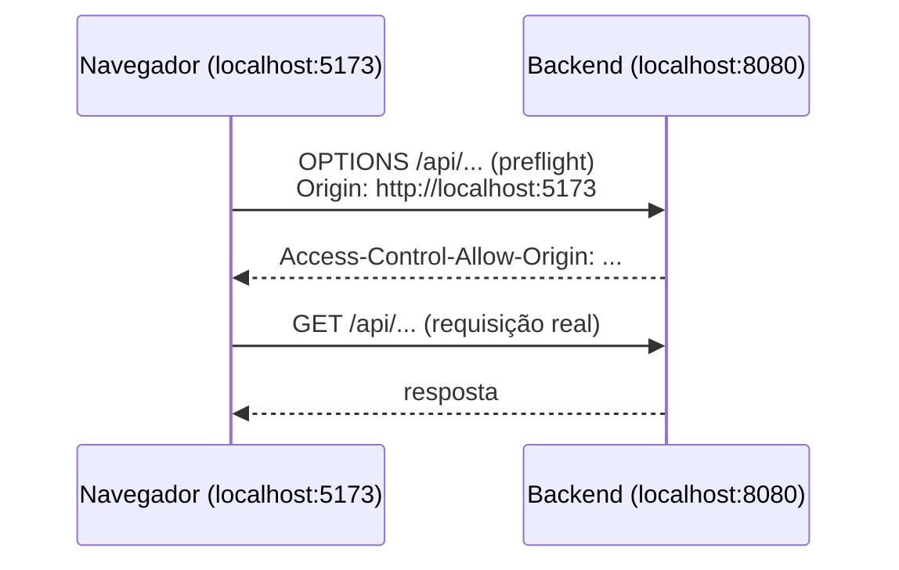

# Estudo — CARD-005

Guia de apoio para o [CARD-005 — Frontend React + TypeScript chamando o backend](../cards/CARD-005.md).

- A **Parte 1** resume os conceitos do card, com exemplos do LifeHub.
- A **Parte 2** apoia cada pergunta: o que considerar, as opções e o que cada uma implica. **Não traz a resposta.**
- A **Parte 3** é sua: o que aprendeu e por quê.

---

# Parte 1 — Conceitos

## Vite
Ferramenta de desenvolvimento e build do frontend:
- em **desenvolvimento**, serve os arquivos sob demanda, com recarga instantânea (HMR);
- no **build**, gera arquivos estáticos otimizados em `dist/`, que qualquer servidor web serve.

Variáveis de ambiente:
- ficam em `.env`, `.env.development`, `.env.production`;
- só as que começam com **`VITE_`** chegam ao código, via `import.meta.env.VITE_...`.

> ⚠️ Tudo o que chega ao frontend vai para o **navegador do usuário**, legível por qualquer um. Variável de ambiente no frontend nunca guarda segredo.

## TypeScript em modo `strict`
Liga um conjunto de verificações, entre elas `strictNullChecks`: `null` e `undefined` deixam de caber em qualquer tipo. É o que obriga você a tratar "e se o backend não respondeu?" em tempo de compilação.

## Origem e CORS
**Origem** = protocolo + host + porta. `http://localhost:5173` (Vite) e `http://localhost:8080` (Spring) são origens **diferentes**.

Por padrão, o navegador **bloqueia** que um JavaScript leia a resposta de outra origem (*same-origin policy*). **CORS** é o mecanismo para o **servidor** dizer quais outras origens podem ler as respostas dele.



- O **preflight** (`OPTIONS`) acontece em requisições "não simples": com `Content-Type: application/json`, cabeçalhos customizados (como `Authorization`) ou métodos como `PUT` e `DELETE`.
- O `curl` não é navegador: não aplica a política e não manda preflight. Por isso "funciona no curl e não no navegador".

> ⚠️ O Spring Security avalia a requisição **antes** do Spring MVC. Se a configuração de CORS não estiver na cadeia de segurança, o preflight pode ser barrado por ela, sem credenciais, antes de chegar a qualquer configuração de CORS do MVC.

## Proxy do Vite
O servidor de desenvolvimento do Vite pode **repassar** chamadas (`server.proxy`): o navegador chama `localhost:5173/api/...`, e o Vite encaminha para `localhost:8080/api/...`. Para o navegador, é tudo a **mesma origem**.

## TanStack Query (React Query)
Gerencia **estado do servidor**: dados que moram no backend e que o frontend só copia.
- `useQuery` busca, guarda em cache e expõe estados: `isPending`, `isError`, `data`, `error`;
- refaz a chamada automaticamente em caso de erro (*retry*), ao voltar para a aba (*refetch on focus*), e deduplica chamadas iguais;
- a chave da query (`queryKey`) identifica o dado no cache.

## Material UI
Biblioteca de componentes React. O `ThemeProvider` centraliza cores, tipografia e espaçamentos; `CssBaseline` normaliza o CSS entre navegadores.

## ESLint e Prettier
- **ESLint:** encontra **problemas** (variável não usada, regra de hooks violada).
- **Prettier:** cuida só da **formatação**.
Configurados juntos, o ESLint não deve brigar com o Prettier sobre formatação.

---

# Parte 2 — Apoio às perguntas

### 1. Proxy do Vite ou CORS no backend?
| | Proxy do Vite | CORS no backend |
|---|---|---|
| Configuração | Só no frontend, só em dev | No Spring (e na cadeia de segurança) |
| Em produção | Não existe; precisa de outra solução | Continua valendo |
| Semelhança com produção | Alta, **se** produção for mesma origem | Alta, **se** produção for origens diferentes |

**A pergunta-chave:** em produção (CARD-007), o navegador vai acessar frontend e backend pela **mesma origem** (um Nginx na frente) ou por origens diferentes? A resposta de dev deve imitar a de produção.

### 2. Qual endpoint chamar?
**O que considerar:**
- O `/actuator/health` é para **operação** (monitoramento, orquestrador). Se o frontend depender dele, o que acontece quando você restringir o Actuator?
- Um endpoint de produto, como `GET /api/system/info`, retorna o quê? Versão (do `pom.xml`?), ambiente, hora do servidor?
- **Em qual módulo ele mora?** Não é tarefa, nem calendário. Releia o critério de `shared` que você definiu no CARD-003. Ou ele merece um módulo técnico próprio?

### 3. Liberar o endpoint sem abrir demais
**O que considerar:**
- Regras do `authorizeHttpRequests` são avaliadas **em ordem**: a primeira que casar vence.
- Liberar `/api/system/**` é diferente de liberar `/api/system/info`. O que mais pode aparecer debaixo de `/api/system/` no futuro?
- Liberar só o método `GET`?
- O teste `any_other_route_should_require_authentication` do CARD-003 continua passando?

### 4. Pastas por tipo ou por feature?
```text
Por tipo                    Por feature
src/                        src/
├── components/             ├── system/
├── hooks/                  │   ├── SystemStatus.tsx
├── api/                    │   └── useSystemInfo.ts
└── pages/                  ├── tasks/      (futuro)
                            └── shared/
```
**Pergunta-teste:** releia "Módulo ≠ camada" no `architecture.md`. O argumento vale para o frontend?

### 5. npm ou pnpm, e a versão do Node
| | npm | pnpm |
|---|---|---|
| Vem com o Node | Sim | Precisa instalar (ou `corepack enable`) |
| Espaço em disco | Uma cópia por projeto | Armazenamento compartilhado |
| Rigor com dependências | Permite usar dependência não declarada | Não permite |

**Versão do Node:**
- `.nvmrc` (lido pelo `nvm` e pela action `setup-node`);
- `engines` no `package.json` (avisa ou falha com a versão errada).
**Pergunta-teste:** o CI do CARD-006 vai usar a mesma versão que você?

### 6. Por que React Query para uma chamada só?
**Escreva mentalmente a versão com `useEffect` + `fetch` e conte o que ela precisa fazer à mão:**
- estado de carregamento;
- estado de erro;
- cancelar a resposta se o componente sair da tela antes;
- não buscar duas vezes (o `StrictMode` do React monta o componente duas vezes em desenvolvimento);
- tentar de novo se falhar.

Depois compare com o que o `useQuery` já faz. Pense também nos próximos cards (tasks, Kanban com *optimistic updates* no CARD-016).

---

# Parte 3 — O que aprendi (preencher ao longo do card)

## Decisões e por quê

## O erro de CORS (se apareceu)
_Cole a mensagem do console do navegador e explique a causa._

## Insights

## Dúvidas para o review
